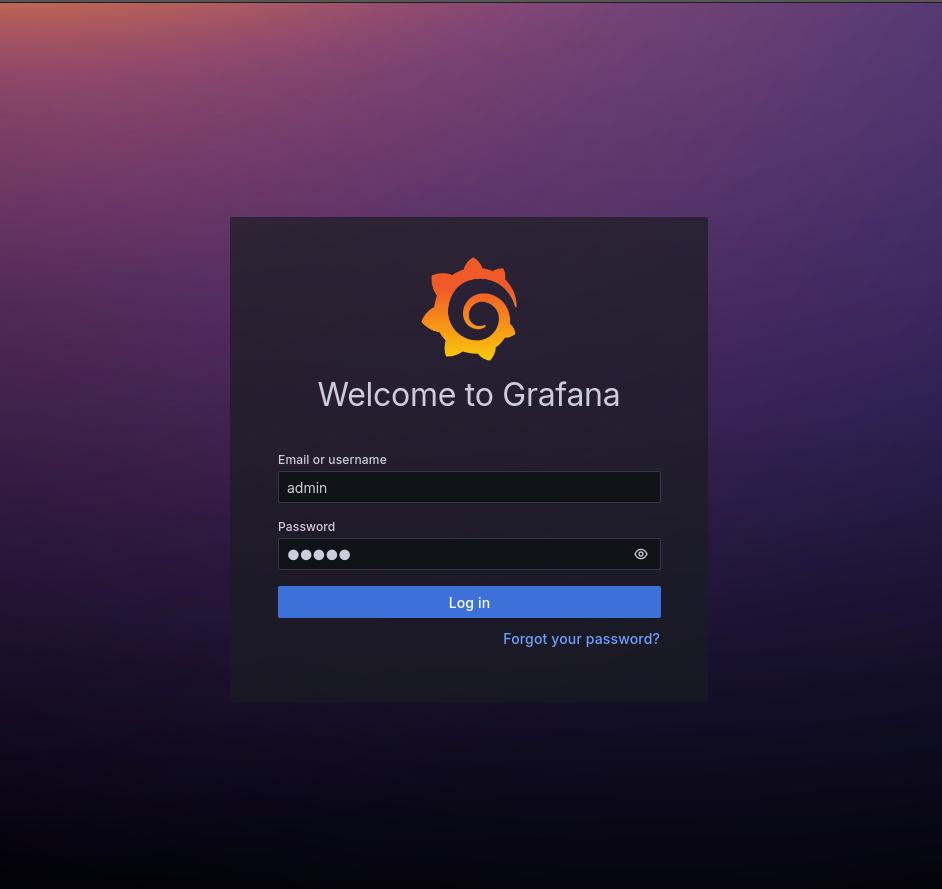
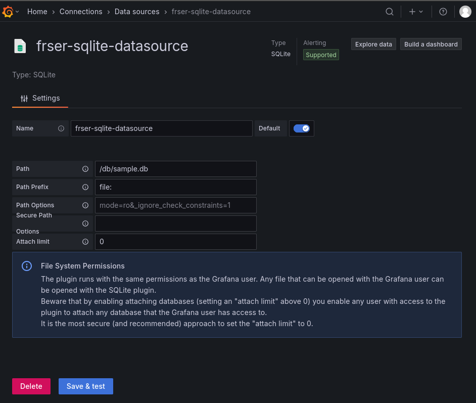
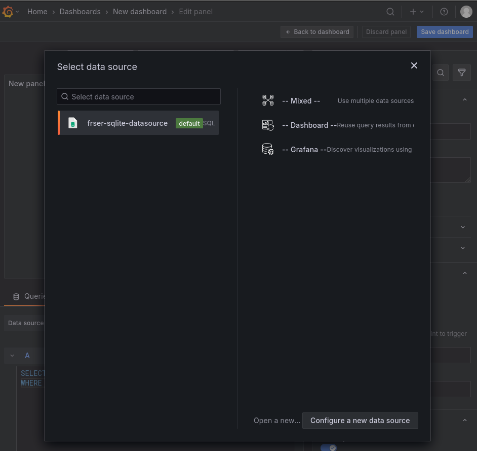
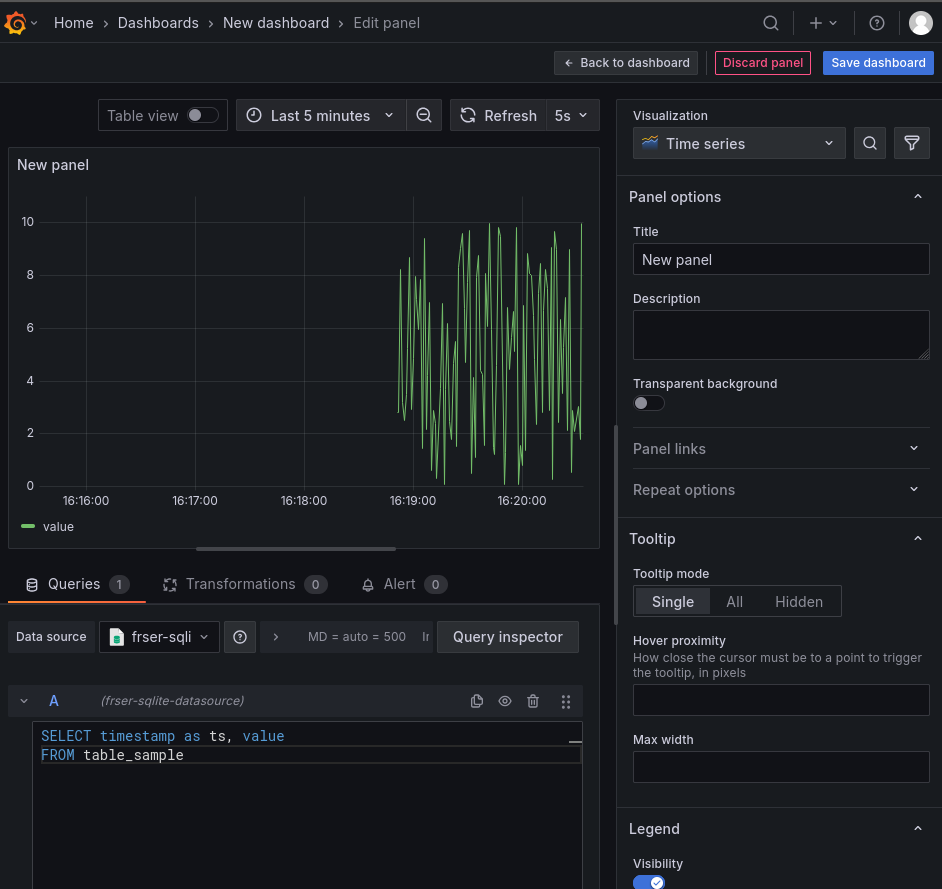

Setup a Grafana-SQLite visualization stack using Podman
===============
<p align="left">
    
    
    
</p>

## Objective 🔍
The objective of this tutorial is to show how to setup a Grafana dashboard that plots time-series data retrieved from an SQLite database, using podman containers.

## Description 📖
If you have a WebPanel with [codesys](https://www.codesys.com/), or some other software that stores time-series data gathered from different input devices inside an SQLite database, and you need to visualize it, this tutorial will guide you throughout every step. As a bonus, this tutorial comes with a custom Python podman image used to create and periodically write an SQLite database with random data.

## Prerequisites 🛠️
- A [WebPanel (WP)](https://www.pixsys.net/en/hmi-panel-pc/web-panel) or [TouchController (TC)](https://www.pixsys.net/en/programmable-devices/hmi-codesys) device
- Basic knowledge of [Grafana](https://grafana.com/)
- Basic knowledge of [SQLite](https://sqlite.org/)
- Basic knowledge of [podman](https://podman.io/) and containers
- Basic knowledge of Linux

## **Steps** 👣
1. Connect to the device via SSH using the **`user`** account:
   
   ```bash
   ssh user@<DEVICE_IP>
   ```
2. Navigate to the persistent folder `/data/user`:
   
   ```bash
   cd /data/user
   ```

3. Create a dedicated folder for the tutorial:
    ```bash
    mkdir grafana-sqlite-visualization-stack
    cd grafana-sqlite-visualization-stack
    ```

4. Create a dedicated folder to have persisent storage for Grafana, and a podman `folder` to keep your configuration files:
    ```bash
    mkdir grafana-data
    mkdir podman
    ```
5. Run the container:

    - If you only need the Grafana container and you already have a working SQLite database, just run:
    
        ```bash
        podman run --userns=keep-id -u $(id -u):$(id -g) -v $(pwd)/grafana-data:/var/lib/grafana -v <SQLITE_FILE_FOLDER>:/db -p 3000:3000 -e GF_PLUGINS_PREINSTALL="frser-sqlite-datasource" grafana/grafana-enterprise:12.0.1
        ```

        **Note: use `--userns=keep-id` to make sure that `user` (your current user) is correctly mapped as container user so that there aren't any RXW permissions. Then, use -u `$(id -u):$(id -g)` to actually use your mapped user as container user**

    - If you need both Grafana and an SQLite database, along with the Python container for simulating data, you will use `podman-compose`.
        
        1. Create an additional folder to store the SQLite database:
            ```bash
            mkdir sqlite-data
            ```
        
        2. Create a `write_sample.py` script to create and write inside the SQLite database:
            ```python
            import sqlite3
            import time
            import random
            import os

            DB_PATH = "sqlite-data/sample.db"
            MAX_ROWS = 100
            DB_TABLE_DEFAULT = "table_sample"
            VALUE_MIN = 0
            VALUE_MAX = 10

            # Ensure the database and table exist
            def init_db():
                conn = sqlite3.connect(DB_PATH)
                cursor = conn.cursor()
                cursor.execute(f'''
                    CREATE TABLE IF NOT EXISTS {DB_TABLE_DEFAULT} (
                        timestamp INTEGER NOT NULL,
                        value REAL NOT NULL
                    )
                ''')
                conn.commit()
                conn.close()

            # Insert a new row every second
            def insert_loop():
                conn = sqlite3.connect(DB_PATH)
                cursor = conn.cursor()
                try:
                    while True:
                        # Check current number of rows
                        cursor.execute(f'SELECT COUNT(*) FROM {DB_TABLE_DEFAULT}')
                        row_count = cursor.fetchone()[0]

                        # Delete the oldest row if over the limit
                        if row_count >= MAX_ROWS:
                            cursor.execute(f'''
                                DELETE FROM {DB_TABLE_DEFAULT}
                                WHERE timestamp = (
                                    SELECT timestamp FROM {DB_TABLE_DEFAULT}
                                    ORDER BY timestamp ASC
                                    LIMIT 1
                                )
                            ''')

                        # Insert new row
                        ts = int(time.time())
                        val = round(random.uniform(VALUE_MIN, VALUE_MAX), 3)
                        cursor.execute(f'INSERT INTO {DB_TABLE_DEFAULT} (timestamp, value) VALUES (?, ?)', (ts, val))
                        conn.commit()
                        print(f"Inserted: {ts}, {val}")
                        time.sleep(1)
                except KeyboardInterrupt:
                    print("Stopped by user.")
                finally:
                    conn.close()

            if __name__ == "__main__":
                init_db()
                insert_loop()
            ```
        
        3. Enter the `docker` folder:
            ```bash
            cd docker
            ```

        2. Create a `sqlite-data-generator.Dockerfile` file to run the SQLite data generator:
            ```dockerfile
            FROM docker.io/python:3.10-slim

            WORKDIR /workspace

            COPY write_sample.py .

            CMD [ "python" ,"./write_sample.py"]
            ```
        
        3. Create a `podman-compose.yml` file:
            ```yml
            services:
                grafana:
                    image: docker.io/grafana/grafana-enterprise:12.0.1
                    container_name: grafana-example
                    restart: always
                    environment:
                    - GF_PLUGINS_PREINSTALL="frser-sqlite-datasource"
                    userns_mode: keep-id
                    user: ${MY_UID}:${MY_GID}
                    volumes:
                    - ${ROOT_DIR}/grafana-data:/var/lib/grafana
                    - ${ROOT_DIR}/sqlite-data:/db
                    depends_on:
                    - sqlite-data-generator
                    network_mode: host
                
                sqlite-data-generator:
                    build:
                    context: ..
                    dockerfile: docker/sqlite-data-generator.Dockerfile
                    image: sqlite-data-generator-example
                    container_name: sqlite-data-generator-example
                    restart: always
                    userns_mode: keep-id
                    user: ${MY_UID}:${MY_GID}
                    volumes:
                    - ${ROOT_DIR}/sqlite-data:/workspace/sqlite-data
                    network_mode: host

            ```

        3. Build and run the compose:
            ```bash
            MY_UID=$(id -u) MY_GID=$(id -g) ROOT_DIR=$(pwd) podman-compose -f docker/podman-compose.yml up --build
            ```

            **Note: in this case, the --userns and the user mapping are performed internally in the podman-compose.yml, and you just need to pass your UID and the GID**

            **Note 2: make sure your container has access to internet so that grafana can download its plugins. This is not trivial since some firewall rules for Docker/Podman must be set. For the sake of ease and for development usage, add --network=host to the command above**

6. Access the Grafana dashboard by navigating to `localhost:3000` if you are physically interacting with your target device, or to `<DEVICE_IP>:3000` if you have remote access to your target device. You should see the default login page of Grafana.

7. Access using:
    - user: admin
    - password: admin

    then you can optionally modify the default password (suggested).
    

8. In order to plot data from the SQLite database, you first need to configure the [data-source for SQLite](https://grafana.com/docs/grafana/latest/datasources/). Go to Home->Connections->Data sources->Add data source, look for SQLite (the plugin installed using *GF_PLUGINS_PREINSTALL*), select it and use */db/sample.db* as path for the database file. You can leave the rest of the configuration as it is, then press "Save and test".
    

9. Go to Home->Dashboards and create a new dashboard. Select the previous configured data-source as data source of the dashboard and create the dashboard
    

    Then, scroll down to the query input file and write:
    ```mysql
    SELECT timestamp as ts, value
    FROM table_sample
    ```
    save the query (or click outside the input text of the query) and you should see a plot of the default panel. 
    


